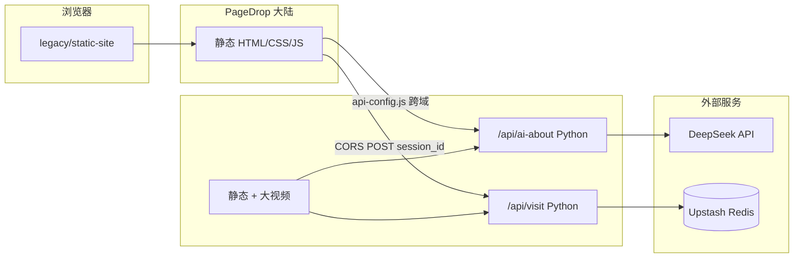

# 海立婷 · 求职作品集 — 技术栈与面试话术

> 仓库：`my`（求职作品集）  
> 正式站：[PageDrop 主站](https://pagedrop.dev/s/hailiting/) · [Vercel 全量](https://hailiting.vercel.app)

---

## 一、30 秒项目介绍（背熟）

> 这是我为求职做的**个人作品集站点**，前端是**原生 HTML/CSS/JS 静态站**，后端用 **Vercel Python Serverless** 做两件事：一是**代理 DeepSeek** 做「按关键词生成第三方视角介绍」，二是用 **Upstash Redis** 做**访问统计**。  
> 部署上是**双轨**：大陆访问走 **PageDrop** 静态托管，API 和超大录屏走 **Vercel**；静态站和 API 通过 **CORS + 可配置 API Base** 跨域打通。  
> 仓库里还有一个 **Flutter Web 实验版**（Riverpod + go_router），展示跨端能力，但**主站已切到静态站**，更利于大陆访问和 SEO。

---

## 二、技术栈总览（按层）

| 层级 | 技术 | 在本项目中的用途 |
|------|------|------------------|
| **前端（主站）** | HTML5、CSS3、原生 JavaScript | 多页静态站：首页、技能词云、AI 页、架构页、作品体验页 |
| **前端交互** | Canvas / DOM 动画、`requestAnimationFrame` | 可点击「技术词云」、中英文 i18n、`localStorage` 会话 ID |
| **前端（实验）** | Flutter 3.5、Dart、Flutter Web | `portfolio_app/`：Riverpod 状态、go_router 路由、技能雷达/词云组件 |
| **后端** | Python 3.12、Vercel Serverless Functions | `api/ai-about.py`、`api/visit.py`（`BaseHTTPRequestHandler` 风格 handler） |
| **业务逻辑** | 纯 Python 标准库（`urllib`、`json`） | `lib/deepseek.py`、`lib/analytics.py`、`lib/http_util.py`，无 Flask/FastAPI 依赖 |
| **AI** | DeepSeek Chat API（`deepseek-chat`） | System Prompt 约束事实 + 用户关键词 → 200–350 字介绍；未配置 Key 时 503 + 前端本地模板回退 |
| **数据** | Upstash Redis（REST）/ Vercel KV 注入 | `INCR` 浏览量、`SADD`/`SCARD` 独立访客；本地 `vercel dev` 用 `.data/visits.json` |
| **部署** | Vercel、PageDrop API、GitHub Actions | 双轨发布脚本；CI 对 API 做 smoke test |
| **工具链** | Bash、`curl`、`zip`、Vercel CLI、`npx vercel dev` | `scripts/deploy-all.sh`、`deploy-pagedrop.sh` |
| **工程化 / AI 研发** | Cursor、Agent Skills、MCP（文档与架构页阐述） | `.cursor/skills/`；架构页描述 LangChain/LangGraph **演进方向**（当前实现为轻量代理链） |

---

## 三、架构一张图（面试可画白板）



**双轨部署要点（高频追问）：**

- PageDrop ZIP **上限 10MB**，脚本**排除** `assets/video/`，录屏只在 Vercel 提供。
- `legacy/static-site/js/api-config.js`：在 `pagedrop.dev` 域名下自动把 API 指到 `https://hailiting.vercel.app`。
- Python API 统一加 **CORS `*`**，支持静态站与 API **分离部署**。

---

## 四、核心功能 ↔ 技术实现（面试展开用）

### 1. AI 智能介绍

| 项 | 说明 |
|----|------|
| 接口 | `POST /api/ai-about`，body：`{ "keyword": "区块链" }` |
| 实现 | `lib/deepseek.py` → DeepSeek `chat/completions`，System Prompt 写死候选人事实，防幻觉 |
| 降级 | 无 `DEEPSEEK_API_KEY` → HTTP **503**，前端用本地模板文案 |
| 安全 | API Key **只在 Vercel 环境变量**，不进前端、不进 Git |

**可说的亮点：** Prompt 工程（事实约束、字数、温度 0.65）、服务端代理藏 Key、503 优雅降级。

### 2. 访问统计

| 项 | 说明 |
|----|------|
| 接口 | `POST /api/visit` 记录；`GET /api/visit` 查询 |
| 存储 | 生产 **Upstash Redis REST**；开发本地 JSON 文件 |
| 指标 | `page_views`（计数器）、`unique_visitors`（session_id 集合基数） |

**可说的亮点：** Serverless 无状态函数 + 外部 Redis 持久化；兼容 Vercel 注入的 `KV_*` 与 `UPSTASH_*` 两套环境变量名。

### 3. 技术全景图 / 技能证据链

- 首页 **动态词云**（`skill-cloud.js` + `skill-data.js`），点击跳转 `skill.html?slug=xxx`。
- **作品体验页** `experience.html`：录屏 + 外链（如 Faypay），体现「技能 → 证据」闭环。

### 4. Flutter 实验版（`portfolio_app/`）

| 依赖 | 用途 |
|------|------|
| `flutter_riverpod` | 主题、路由等状态 |
| `go_router` | ShellRoute + Feature 分页 |
| `http` | 调 `/api/ai-about` 或直连 DeepSeek（`--dart-define`） |
| `google_fonts`、`url_launcher` | UI 与外链 |

**面试诚实说法：** 主站选静态站是为了**加载速度、大陆 CDN、SEO**；Flutter 版证明**跨端与组件化**能力，不是当前线上主路径。

---

## 五、部署与 DevOps（简答）

```text
本地静态预览：  cd legacy/static-site && python3 -m http.server 8080
本地含 API：      cp .env.example .env && npx vercel dev
仅 Vercel：       npx vercel --prod --yes
仅 PageDrop：     bash scripts/deploy-pagedrop.sh   # 需 PAGEDROP_DELETE_TOKEN
双轨一键：        bash scripts/deploy-all.sh        # git push + vercel + pagedrop
CI：              .github/workflows/deploy-portfolio.yml → Python 3.12 smoke test
```

环境变量（见 `.env.example` / `DEPLOY.md`）：

- `DEEPSEEK_API_KEY` — AI
- `KV_REST_API_URL` + `KV_REST_API_TOKEN`（或 Upstash 同名变量）— 统计
- `PAGEDROP_DELETE_TOKEN` — 更新 PageDrop 站点

---

## 六、面试话术模板

### Q1：这个项目用了哪些技术？

**答（结构化）：**

1. **展示层**：主站原生 HTML/CSS/JS；词云与 i18n 自研；另有 Flutter Web 实验分支。  
2. **服务层**：Vercel 上 Python 3.12 Serverless，标准库调 DeepSeek 和 Upstash，刻意**零第三方 Python 依赖**降低冷启动体积。  
3. **数据层**：Redis 存访问计数与 UV。  
4. **部署层**：Vercel + PageDrop 双轨，解决大陆访问与大文件限制。  
5. **AI 层**：DeepSeek 对话 API + Prompt 约束；架构上预留 LangChain/LangGraph 多步 Agent（文档与专页，代码当前是单链代理）。

### Q2：为什么不用 React/Vue？

**答：** 作品集以**内容传达和首屏速度**为主，页面以多页静态 + 少量 JS 增强为主，**不需要重型框架运行时**。需要组件化与跨端时，用 **Flutter Web** 单独分支演示，和主站职责分离。

### Q3：为什么 Python 不用 FastAPI？

**答：** Vercel Python 函数入口是 **handler 类**；业务逻辑抽到 `lib/`，用 **urllib 直连** DeepSeek/Upstash，**依赖为零**，部署简单、冷启动更轻。若业务变复杂再上 FastAPI 或迁到独立 API 服务。

### Q4：双域部署怎么解决跨域？

**答：** 后端 `lib/http_util.py` 统一 **CORS**；前端 `api-config.js` 按 hostname 判断，PageDrop 域自动拼接 Vercel API Base；同域部署时仍走相对路径 `/api/*`。

### Q5：你怎么保证 AI 不胡说？

**答：** System Prompt **只许根据给定事实**生成；关键词长度限制；服务端代理；失败走 **503 + 本地模板**，不伪造「实时 AI」。

### Q6：和 LangChain/LangGraph 的关系？

**答（务必诚实）：** 当前线上是 **Prompt → DeepSeek 单次调用**；架构页写的是**下一步**用 LangChain/LangGraph 做检索、分支、回退的有状态图。面试可以说「**已设计演进路线，轻量版已上线**」，避免说成「全站已用 LangGraph 跑生产」。

---

## 七、和简历 / 代表作的衔接（加分）

面试时把本站和**真实业务**绑在一起说：

| 本站能力 | 可关联经历 |
|----------|------------|
| Web3、跨端、钱包体验页 | **Faypay** 多链钱包（一人核心开发） |
| Chrome 插件、DeFi 词云 | OpenWallet、Kaco 等项目 |
| AI 代理、Serverless | 当前 AI 辅助研发栈（Cursor、Skills、MCP） |
| Flutter 分支 | 11 年经验里的 Flutter/Dart 跨端 |

---

## 八、现场演示顺序（3–5 分钟）

1. 打开 **PageDrop 主站** → 技术词云 → 点「Flutter / Faypay」进技能证据页。  
2. 打开 **AI 交流** → 输入「区块链」→ 展示 DeepSeek 实时文案（需 Key 已配置）。  
3. 页脚 **浏览量 / 访客数** → 说明 Redis 统计。  
4. （可选）打开 **架构专页** → 讲双轨部署 + Agent 演进。  
5. （若问跨端）本地或截图展示 **Flutter Web** `portfolio_app`。

控制台彩蛋：`hireMe()`（体现细节与趣味性，一笔带过即可）。

---

## 九、面试官可能追问 · 短答备忘

| 追问 | 建议答法 |
|------|----------|
| Serverless 冷启动？ | Python 轻依赖；统计走 Redis 避免实例内内存丢数据 |
| Redis 为什么用 REST 不用连接池？ | Vercel 函数适合 HTTP 型 Upstash REST，无长连接 |
| 如何防刷访问？ | 可补充：按 IP 限流、验证码（当前 MVP 未做，诚实说可迭代） |
| 词云性能？ | `requestAnimationFrame`、尊重 `prefers-reduced-motion` |
| 测试？ | `scripts/test_local.py` + GitHub Actions smoke test |
| 和 Flutter 主站关系？ | 主站静态；Flutter 为能力展示分支 |

---

## 十、一句话定位（收尾）

> **「用最小技术栈完成可演示的全栈作品集：静态前端 + Python Serverless + 大模型 API + Redis，并用双 CDN 部署解决大陆访问和资源限制。」**

---

## 附录：仓库目录速查

```text
legacy/static-site/   # 正式前端
api/                  # Vercel Python 入口
lib/                  # DeepSeek、统计、HTTP 工具
portfolio_app/        # Flutter Web 实验版
scripts/              # 部署与测试脚本
vercel.json           # 静态输出目录 + API 路由
```

更细的部署步骤见 [DEPLOY.md](./DEPLOY.md)，仓库说明见 [README.md](./README.md)。
